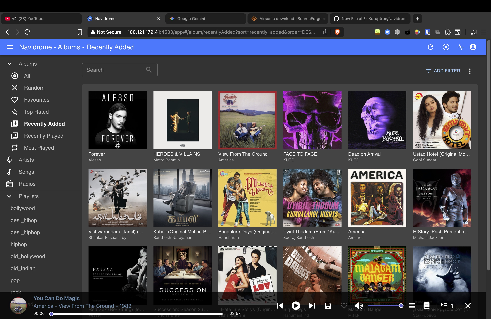
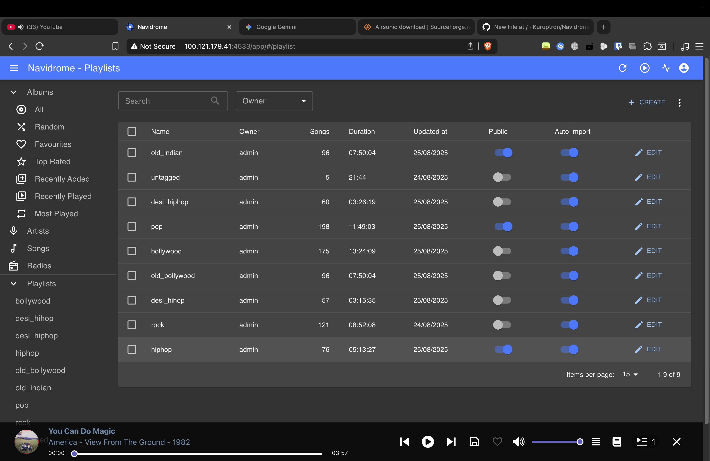
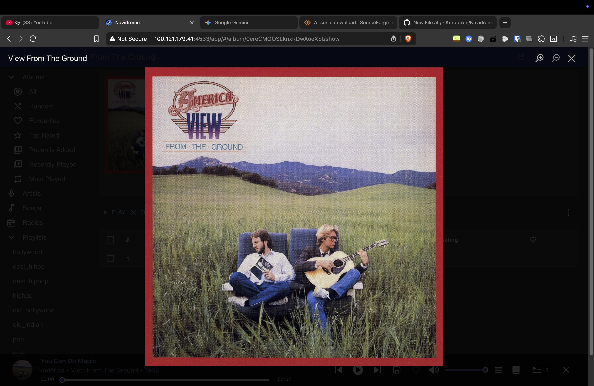
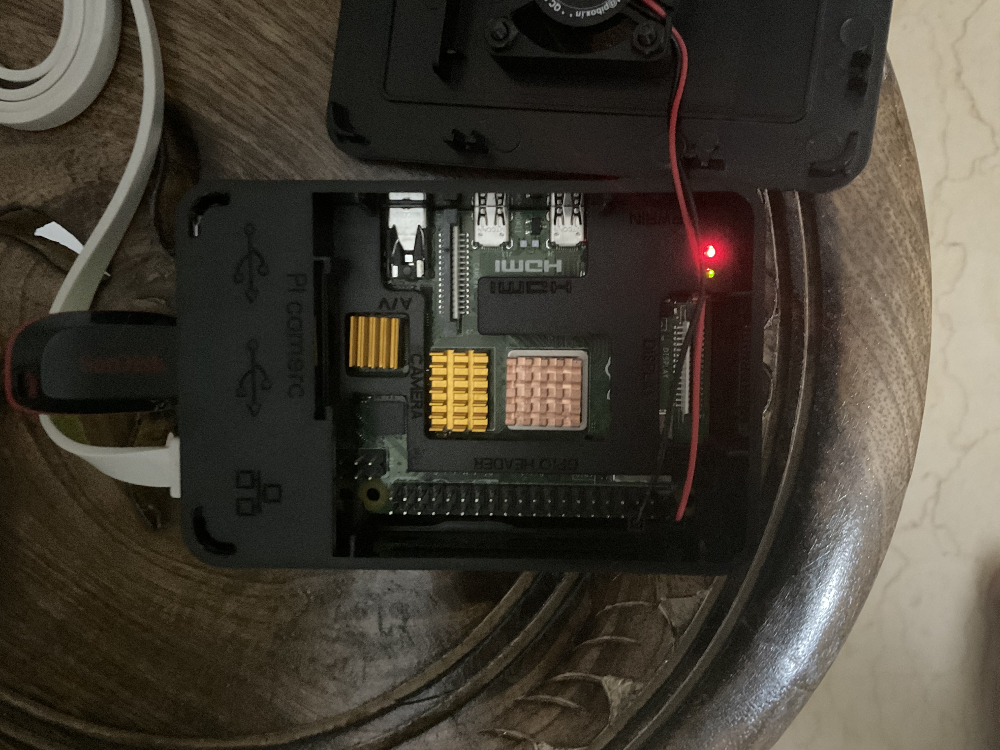

# Home Music Streaming Service - Your Free, Self-Hosted Music Streaming 🎵

Ditch the expensive streaming subscriptions! This project transforms a powerful **Raspberry Pi 4B (8GB RAM)** and the brilliant **Navidrome** music server into your personal, **completely free** Spotify alternative. Enjoy full ownership of your music and stream it effortlessly and securely across all your devices using **Tailscale** and a **Subsonic**-compatible client like **Symfonium**.


---

## About The Project

This project emerged from a desire for true music ownership and a modern, user-friendly streaming experience, all without the burden of subscription costs. Leveraging the efficiency of a Raspberry Pi 4B as a dedicated home server ensures my entire music collection is always accessible.

At its heart is **Navidrome**, an exceptional open-source music server that meticulously catalogs your music library and serves it through the standard **Subsonic API**. This allows a wide range of client applications to connect and stream music. For secure access from anywhere in the world, this setup uses **Tailscale** to create a private network, making your home server available on your phone or laptop as if you were on the same WiFi.

### Key Features ✨

* **Self-Hosted & Private**: Your music resides securely on your own server. No data collection, no interruptions from ads.
* **Secure Remote Access**: With **Tailscale**, your music server is available anywhere on a secure, private network. No complex firewall rules or port forwarding needed.
* **Low Power, Always On**: The Raspberry Pi's minimal power consumption makes it ideal for continuous operation.
* **Broad Client Compatibility**: Thanks to the **Subsonic API**, you can use dozens of apps, including the highly-rated **Symfonium** for mobile.
* **Completely Free**: The core software stack is free. Say goodbye to monthly subscription fees.
* **Open Source**: Built upon the robust foundation of Navidrome and the collaborative spirit of the open-source community.

---

### Tech Stack

<p align="left">
  <a href="https://www.raspberrypi.org/" target="_blank" rel="noreferrer"></a>
  <a href="https://www.navidrome.org/" target="_blank" rel="noreferrer"></a>
  <a href="https://tailscale.com/" target="_blank" rel="noreferrer"></a>
  <a href="https://symfonium.app/" target="_blank" rel="noreferrer"></a>
  <a href="http://www.subsonic.org/pages/api.jsp" target="_blank" rel="noreferrer"></a>
  <a href="https://www.linux.org/" target="_blank" rel="noreferrer"></a>
</p>

---

## How It Works: The Architecture 🧠

The system architecture is straightforward, comprising a server, a secure network layer, and a client application.

### 1. The Core (Backend Server)

* **Hardware**: A **Raspberry Pi 4B (8GB RAM)** seamlessly integrated into my home network.
* **Software**: **Navidrome**, running as a hardened systemd service on Raspberry Pi OS. It scans, indexes, and serves your music via the Subsonic API.

### 2. The Secure Network (VPN)

* **Software**: **Tailscale**. It runs on the Raspberry Pi and your client devices (phone, laptop). It creates a secure peer-to-peer connection, giving your Pi a stable IP address that only you can access, no matter where you are.

### 3. The Interface (Frontend Client)

* **Recommended Mobile Client**: **Symfonium** is a feature-rich music app for Android that connects directly to Navidrome for a premium, Spotify-like experience.
* **This Repository's Custom Client**: This is the custom application housed in this very repository!
    * **Built With**: `[Your Framework/Language here, e.g., React Native, Flutter, Swift, Next.js]`
    * **Function**: It communicates with the Navidrome server using the Subsonic API to provide a rich browsing and playback experience.

---

## Getting Started 🚀

This guide is for a **native installation** using a `systemd` service. The paths and user configurations are specific to this implementation.

### Prerequisites

* A Raspberry Pi with Raspberry Pi OS installed.
* An external hard drive with your music collection.
* A user named `spk-rasp` belonging to the `users` group.
* A free **Tailscale** account.

### Step 1: Install and Configure Navidrome (Native Method)

1.  **Download Navidrome:** Get the latest `ARM64` release from the [official Navidrome releases page](https://github.com/navidrome/navidrome/releases).
2.  **Create Directories & Place Files:**
    * Unpack and move the `navidrome` binary to `/usr/bin/`:
        ```sh
        tar -xvzf navidrome_*_linux_arm64.tar.gz
        sudo mv navidrome /usr/bin/
        ```
    * Create the necessary folders:
        ```sh
        sudo mkdir -p /opt/navidrome/music
        sudo mkdir -p /var/lib/navidrome
        ```
    * Copy your music to `/opt/navidrome/music` and ensure the `spk-rasp` user has ownership.
3.  **Create the Configuration File** at `/etc/navidrome/navidrome.toml`:
    ```sh
    sudo mkdir -p /etc/navidrome
    sudo nano /etc/navidrome/navidrome.toml
    ```
    * Paste in your configuration:
        ```toml
        DataFolder = "/var/lib/navidrome"
        MusicFolder = "/opt/navidrome/music"
        ScanSchedule = "30m"
        ```
4.  **Create the Systemd Service File** at `/etc/systemd/system/navidrome.service`:
    ```sh
    sudo nano /etc/systemd/system/navidrome.service
    ```
    * Paste the hardened service configuration:
        ```ini
        [Unit]
        Description=Navidrome Music Server and Streamer compatible with Subsonic/Airsonic
        After=remote-fs.target network.target
        AssertPathExists=/var/lib/navidrome

        [Install]
        WantedBy=multi-user.target

        [Service]
        User=spk-rasp
        Group=users
        Type=simple
        ExecStart=/usr/bin/navidrome --configfile /etc/navidrome/navidrome.toml
        WorkingDirectory=/var/lib/navidrome
        TimeoutStopSec=20
        KillMode=process
        Restart=on-failure
        # Security Hardening
        DevicePolicy=closed
        NoNewPrivileges=yes
        PrivateTmp=yes
        PrivateUsers=yes
        ProtectControlGroups=yes
        ProtectKernelModules=yes
        ProtectKernelTunables=yes
        RestrictAddressFamilies=AF_UNIX AF_INET AF_INET6
        RestrictNamespaces=yes
        RestrictRealtime=yes
        SystemCallFilter=~@clock @debug @module @mount @obsolete @reboot @setuid @swap
        ReadWritePaths=/var/lib/navidrome
        ProtectSystem=full
        ProtectHome=true
        ```
5.  **Enable and Start Navidrome:**
    ```sh
    sudo systemctl daemon-reload
    sudo systemctl enable --now navidrome
    ```
6.  **Access the Web UI Locally:** Navigate to `http://[YOUR_LOCAL_RPI_IP]:4533` to create your admin user.

### Step 2: Enable Secure Remote Access with Tailscale

1.  **Install Tailscale on your Raspberry Pi:**
    ```sh
    curl -fsSL [https://tailscale.com/install.sh](https://tailscale.com/install.sh) | sh
    ```
2.  **Start Tailscale and Authenticate:**
    ```sh
    sudo tailscale up
    ```
    Follow the printed URL to log in with your Tailscale account and authorize the Raspberry Pi.
3.  **Find your Pi's Tailscale IP:** In the [Tailscale admin console](https://login.tailscale.com/admin/machines), find your Raspberry Pi and note its IP address (it will look like `100.X.X.X`). This IP is static and will not change.

### Step 3: Connect a Client App

Now, install Tailscale on your phone or laptop. Once you're logged into the same Tailscale account, you can connect to Navidrome using the Pi's Tailscale IP.

#### Option A: Use Symfonium (Recommended for Mobile)

1. Install **Symfonium** from the app store.
2. Install and log into the **Tailscale** app on your phone.
3. In Symfonium, add a new media provider. Select **Navidrome** or **Subsonic**.
4. For the server address, enter: `http://[YOUR_PI_TAILSCALE_IP]:4533`.
5. Enter the username and password you created in Navidrome. Your entire library will now sync to your phone!

#### Option B: Configure and Run This Custom Client

1.  **Clone this repository:**
    ```sh
    git clone [Your Git Repo URL]
    ```
2.  **Install dependencies:**
    ```sh
    cd [Your Project Directory]
    npm install
    ```
3.  **Edit the configuration file** (`[src/config.js]` or similar):
    * Update the server URL to your Pi's **Tailscale IP**: `http://[YOUR_PI_TAILSCALE_IP]:4533`.
    * Enter the credentials for your Navidrome user.
4.  **Start the client application:**
    ```sh
    npm start
    ```

---

## License

Distributed under the MIT License. See the `LICENSE` file for complete terms and conditions.

## Acknowledgements

* [**Navidrome**](https://www.navidrome.org/): For developing an exceptional open-source music server.
* [**Raspberry Pi Foundation**](https://www.raspberrypi.org/): For their incredible contribution to accessible computing.
* [**Tailscale**](https://tailscale.com/): For making complex networking simple and secure.
* [**Symfonium**](https://symfonium.app/): For creating a beautiful and powerful Subsonic client.

---

## Gallery

Here are some screenshots of the client application and the physical server setup.





### The Server


